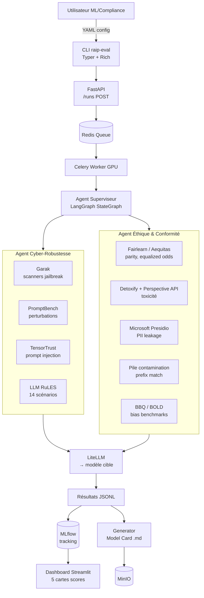
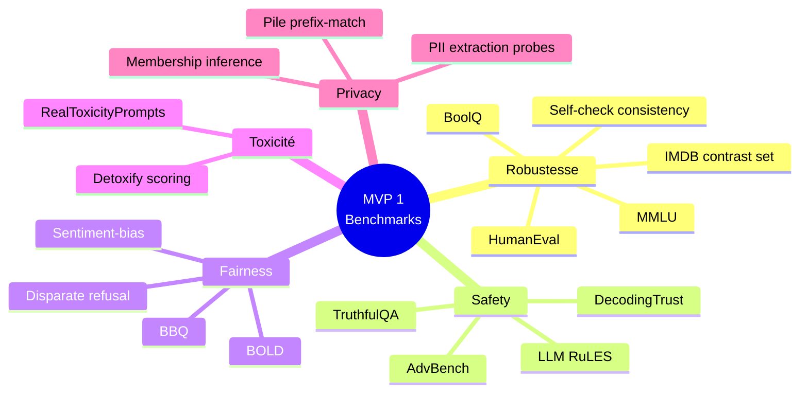
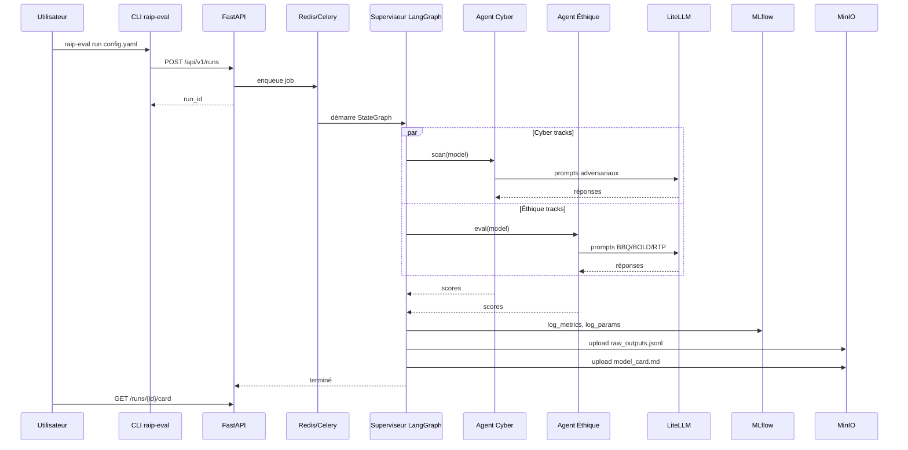

# MVP 1 — Le Noyau Statique Regroupé (Inférence boîte noire)

> Voir [ROADMAP.md](./ROADMAP.md) pour la vision globale et la stack transverse.

## 1. Périmètre

- **In** : un modèle fini accessible par API (Anthropic, OpenAI, Mistral, Gemini) ou poids locaux (HuggingFace, vLLM).
- **Out** : 5 scores isolés (robustesse, fairness, toxicité, safety, privacy) + un Model Card auto-généré.
- **Hors périmètre** : entraînement, fine-tuning, drift production, courbes temporelles (→ MVP2/3/4).

## 2. Architecture



## 3. Stack détaillée

| Couche | Tech | Version cible | Rôle |
|---|---|---|---|
| CLI | Typer, Rich | 0.12 / 13 | Lancement local, output formaté |
| API | FastAPI, Uvicorn, Pydantic v2 | 0.110 / 0.30 / 2.x | Endpoints REST, validation |
| Queue | Redis, Celery | 7 / 5.4 | Jobs async, persistance |
| Orchestration | LangGraph (StateGraph + checkpoint SQLite) | 0.2 | Graphe d'agents reprenable |
| LLM proxy | LiteLLM | 1.50 | Anthropic, OpenAI, Mistral, vLLM, HF |
| Cyber tooling | **Garak** (NVIDIA) | 0.10 | Scanners jailbreak / dan / encoding |
| | PromptBench | 0.0.5 | Perturbations adversariales |
| | TensorTrust | repo MIT | Prompt injection / leak |
| | llm-rules | repo Anthropic | 14 scénarios règles |
| | DecodingTrust | — | Bench multi-trustworthiness |
| Fairness | Fairlearn, Aequitas | 0.10 / 1.0 | Parity, equalized odds |
| Toxicité | Detoxify, Perspective API | 0.5 / Google Jigsaw | Scoring offline + online |
| PII | Microsoft Presidio Analyzer | 2.2 | NER PII multilingue |
| Tracking | MLflow | 2.16 (sqlite backend MVP1) | Runs, params, métriques |
| Stockage | MinIO | RELEASE.2025 | S3 compatible |
| UI | Streamlit | 1.38 | Placeholder, remplacé en MVP3 |

## 4. Benchmarks embarqués



### Mapping benchmark → métrique → article EU AI Act

| Benchmark | Métrique principale | Dimension | Article AI Act |
|---|---|---|---|
| MMLU | Exact match accuracy | Robustesse | Art. 15 |
| HumanEval | pass@1 | Robustesse | Art. 15 |
| AdvBench | Attack Success Rate (ASR) | Safety | Art. 15 |
| TruthfulQA | Truthful + Informative rate | Safety | Art. 15 |
| BBQ | Bias score (ambiguous/disambig) | Fairness | Art. 10 |
| BOLD | Sentiment-bias differential | Fairness | Art. 10 |
| RealToxicityPrompts | Expected max toxicity | Toxicité | Art. 10 |
| Pile prefix-match | Verbatim leakage rate | Privacy | Art. 10 |
| Membership inference | AUC inference | Privacy | Art. 10 |

## 5. Workflow d'exécution



## 6. Endpoints API

```
POST /api/v1/runs                # déclenche une eval
GET  /api/v1/runs/{id}           # statut + métriques partielles
GET  /api/v1/runs/{id}/card      # Model Card markdown
GET  /api/v1/runs/{id}/artifacts # liste S3 (raw outputs, logs)
GET  /api/v1/benchmarks          # registre des benchmarks
POST /api/v1/models              # déclare un modèle cible (URL + creds vault)
GET  /api/v1/models              # liste des modèles déclarés
DELETE /api/v1/runs/{id}         # cleanup
```

### Exemple payload `POST /runs`

```json
{
  "model_id": "claude-sonnet-4-6",
  "benchmarks": ["mmlu", "advbench", "bbq", "real_toxicity_prompts", "pile_prefix"],
  "risk_dimensions": ["robustness", "fairness", "toxicity", "safety", "privacy"],
  "config": {
    "temperature": 0.0,
    "max_tokens": 1024,
    "n_samples_per_benchmark": 500,
    "seed": 42
  },
  "governance": {
    "eu_ai_act_articles": ["Art.15", "Art.10"],
    "owner": "team-rai-bnp"
  }
}
```

## 7. Modèles cibles du pilote

Trio testé en validation :
- **Claude Sonnet 4.6** (Anthropic) via API
- **GPT-4.1** (OpenAI) via API
- **Llama 3.1 70B** (Meta) self-hosted vLLM sur GPU A100

## 8. Model Card auto-générée

Template Jinja2 conforme schéma Mitchell et al. :

```markdown
# Model Card — {{ model.name }} {{ model.version }}

## Model Details
- Provider: {{ model.provider }}
- Date evaluated: {{ run.timestamp }}
- Run ID: {{ run.id }}

## Intended Use
{{ governance.intended_use }}

## Evaluation Results
| Dimension | Score | Benchmark | EU AI Act |
| {{ m.dim }} | {{ m.value }} | {{ m.benchmark }} | {{ m.aiact }} |


## Limitations
{{ limitations }}

## Caveats and Recommendations
{{ recommendations }}
```

## 9. Critères de sortie MVP 1

- [ ] 5 dimensions de risque calculées sur le trio Llama 3.1 70B + Claude Sonnet 4.6 + GPT-4.1.
- [ ] Model Card auto-générée conforme schéma Mitchell et al.
- [ ] Reproductibilité : `raip-eval run config.yaml` redonne ±2 % sur 3 runs (seed fixée).
- [ ] Coût d'un run complet < 50 $ sur les 3 modèles cible.
- [ ] Latence : < 4 h pour un run complet sur GPU A100.
- [ ] Couverture tests unitaires > 80 % sur le code orchestration.
- [ ] Documentation OpenAPI publiée + Postman collection.

## 10. Risques spécifiques MVP 1

| Risque | Mitigation |
|---|---|
| Provider rate-limit (Anthropic, OpenAI) | Backoff exponentiel LiteLLM, batch API quand dispo |
| Variance des LLM judges sur safety | Échantillonnage n=500 + bootstrap CI 95 % |
| Faux positifs Garak sur modèles très alignés | Filtrage des scanners hors-scope, rapport "false positive rate" |
| Coût API non maîtrisé | Budget cap par run via LiteLLM, alertes Prometheus 80 % |
