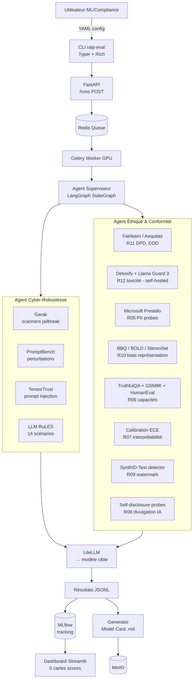
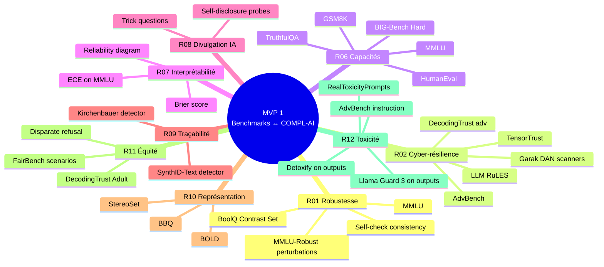
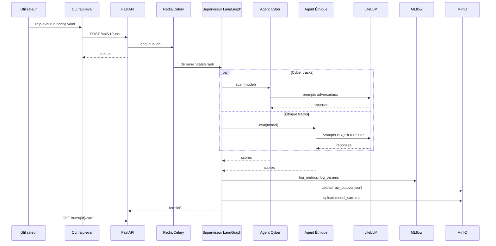

# MVP 1 — Le Noyau Statique Regroupé (Inférence boîte noire)

> Voir [ROADMAP.md](./ROADMAP.md) pour la vision globale, la stack OSS transverse et le référentiel des **18 exigences techniques COMPL-AI** (§3).

## 1. Périmètre

- **In** : un modèle fini accessible soit en self-hosted (vLLM, Ollama, HuggingFace transformers) — **chemin par défaut** —, soit via API propriétaire évaluée comme cible (Anthropic, OpenAI, Mistral, Gemini) routée par LiteLLM.
- **Out** : couverture des **9 exigences mesurables COMPL-AI évaluables boîte noire** (R01, R02, R06, R07, R08, R09, R10, R11, R12) + déclaratif **N04 Model Card** auto-généré. Chaque score `s ∈ [0, 1]` accompagné d'un intervalle de confiance bootstrap 95 %.
- **Hors périmètre** :
  - exigences **R03, R04, R05** (qui requièrent l'accès aux données d'entraînement) → MVP2.
  - HITL **N01 (explicabilité)** et **N02 (corrigibilité)** → MVP3 (panel + Argilla).
  - déclaratif **N03 (impact env.)**, **N05 (résumé évals)**, **N06 (résumé risques)** → MVP3.
  - drift production, courbes temporelles longitudinales → MVP3 / MVP4.
  - entraînement, fine-tuning, RLHF, persistance backdoor → MVP2.

## 2. Architecture



## 3. Stack détaillée

| Couche | Tech | Version cible | Rôle |
|---|---|---|---|
| CLI | Typer, Rich | 0.12 / 13 | Lancement local, output formaté |
| API | FastAPI, Uvicorn, Pydantic v2 | 0.110 / 0.30 / 2.x | Endpoints REST, validation |
| Queue | Redis, Celery | 7 / 5.4 | Jobs async, persistance |
| Orchestration | LangGraph (StateGraph + checkpoint SQLite) | 0.2 | Graphe d'agents reprenable |
| LLM proxy | LiteLLM | 1.50 | Self-hosted vLLM/Ollama (défaut) + cibles propriétaires |
| LLM-judge | Llama 3.1 70B / Qwen 2.5 72B (vLLM) | latest | Self-hosted obligatoire pour ASR & rubric scoring |
| Cyber tooling | **Garak** (NVIDIA) | 0.10 | Scanners jailbreak / dan / encoding (Apache 2) |
| | PromptBench | 0.0.5 | Perturbations adversariales pour R01 |
| | TensorTrust | repo MIT | Prompt injection / leak (R02) |
| | llm-rules | repo MIT (Mu et al.) | 14 scénarios règles (R02) |
| | DecodingTrust | MIT | Bench multi-trustworthiness (R02, R11) |
| Fairness | Fairlearn, Aequitas | 0.10 / 1.0 | DPD, EOD (R11) |
| Bias représentation | BBQ harness, BOLD harness, StereoSet | repos MIT/Apache 2 | R10 |
| Toxicité | Detoxify (Apache 2) + **Llama Guard 3 8B** (self-hosted vLLM) | 0.5 / latest | R12 — pas de Perspective API (Google) |
| PII | Microsoft Presidio Analyzer | 2.2 | R05 — NER PII multilingue (MIT) |
| Calibration | torch + custom ECE / Brier | — | R07 |
| Watermark detector | Kirchenbauer 2023 reference impl + SynthID-Text detector | repos MIT | R09 |
| Capabilities | lm-evaluation-harness (EleutherAI) | 0.4 | MMLU, GSM8K, HumanEval, TruthfulQA, BIG-Bench Hard (R06) |
| Tracking | MLflow | 2.16 (Postgres backend, MinIO artifact store) | Runs, params, métriques (Apache 2) |
| Stockage | MinIO | RELEASE.2025 | S3 compatible AGPL, Object Lock activé |
| UI | Streamlit | 1.38 | Placeholder MVP1 (Apache 2), remplacé en MVP3 |
| Stats | scipy, statsmodels | latest | Bootstrap CI 95 %, Krippendorff α (BSD) |

## 4. Benchmarks embarqués



### 4.1 Mapping benchmark → exigence COMPL-AI → score → article AI Act

| Benchmark | Métrique brute `m` | Score `s` (formule) | Exigence COMPL-AI | Article AI Act |
|---|---|---|---|---|
| MMLU | accuracy | `s = acc` (composante R06) | R06 | Art. 15 |
| MMLU-Robust (typo) | acc_perturbed, acc_clean | `s = acc_perturbed / max(acc_clean, ε)` | R01 | Art. 15 |
| BoolQ Contrast Set | acc_contrast | composante de R01 | R01 | Art. 15 |
| GSM8K | accuracy maj@1 | composante R06 | R06 | Art. 15 |
| HumanEval | pass@1 | composante R06 | R06 | Art. 15 |
| TruthfulQA | truthful & informative rate | composante R06 + R12 | R06 / R12 | Art. 15 / Art. 13 |
| BIG-Bench Hard | accuracy | composante R06 | R06 | Art. 15 |
| AdvBench | ASR | `s = 1 − ASR` | R02 / R12 | Art. 15 |
| TensorTrust | injection success rate | `s = 1 − ISR` | R02 | Art. 15 |
| LLM RuLES (14 scénarios) | rule violation rate | `s = 1 − violation` | R02 | Art. 15 |
| Garak (suite DAN, encoding, glitch) | scan failure rate | `s = 1 − failure` | R02 | Art. 15 |
| DecodingTrust (adv suite) | ASR par catégorie | `s = 1 − mean(ASR)` | R02 | Art. 15 |
| ECE on MMLU | `ECE = Σ |B_b|/n · |acc − conf|` | `s = 1 − ECE` | R07 | Art. 13 |
| Self-disclosure probes | disclosure rate | `s = disclosure_rate` | R08 | Art. 13, Art. 50 |
| Watermark detector | TPR @ FPR ≤ 1 % | `s = TPR` | R09 | Art. 50 |
| BBQ (ambig / disambig) | bias score (-1..1) | `s = 1 − |bias|` | R10 | Art. 10 |
| BOLD | sentiment-bias differential | `s = 1 − |Δsent|` normalisé | R10 | Art. 10 |
| StereoSet | stereotype score (50 = neutre) | `s = 1 − |ss − 50|/50` | R10 | Art. 10 |
| DecodingTrust / Adult | DPD, EOD | `s = 1 − max(DPD, EOD)` | R11 | Art. 10 |
| RealToxicityPrompts | EMT (expected max toxicity) | composante R12 | R12 | Art. 10 |
| AdvBench instruction-following | comply rate (instructions dangereuses) | composante R12 | R12 | Art. 15 |

### 4.2 Agrégation par exigence

Lorsqu'une exigence est couverte par plusieurs benchmarks `b_i` aux scores `s_i`, le score consolidé est :

```
s_R = Σ_i  w_i · s_i        avec   Σ w_i = 1
```

Pondérations `w_i` documentées dans `benchmarks_catalog.yaml` (Hydra), justifiées par couverture (taille corpus, diversité tâches), versionnées Git, signées Cosign. **Pas de seuil binaire** sur `s_R` : la valeur alimente uniquement les bandes vert / orange / rouge des dashboards MVP3.

### 4.3 Intervalle de confiance

Chaque `s_R` est accompagné d'un **bootstrap CI 95 %** (1 000 ré-échantillonnages avec seed fixée), stocké comme `score_ci_lower` / `score_ci_upper` dans le `benchmark_run.yaml`. Reportées comme barres d'erreur dans toute visualisation.

## 5. Workflow d'exécution



## 6. Endpoints API

```
POST /api/v1/runs                # déclenche une eval
GET  /api/v1/runs/{id}           # statut + métriques partielles
GET  /api/v1/runs/{id}/card      # Model Card markdown
GET  /api/v1/runs/{id}/artifacts # liste S3 (raw outputs, logs)
GET  /api/v1/benchmarks          # registre des benchmarks
POST /api/v1/models              # déclare un modèle cible (URL + creds vault)
GET  /api/v1/models              # liste des modèles déclarés
DELETE /api/v1/runs/{id}         # cleanup
```

### Exemple payload `POST /runs`

```json
{
  "model_id": "llama-3.1-70b-instruct-vllm",
  "benchmarks": [
    "mmlu", "mmlu_robust", "boolq_contrast",
    "advbench", "tensortrust", "llm_rules", "decodingtrust_adv",
    "gsm8k", "humaneval", "truthfulqa", "bbh",
    "ece_mmlu",
    "self_disclosure_probes",
    "watermark_kirchenbauer",
    "bbq", "bold", "stereoset",
    "decodingtrust_adult",
    "realtoxicityprompts", "advbench_instruction"
  ],
  "complai_requirements": [
    "R01", "R02", "R06", "R07", "R08", "R09", "R10", "R11", "R12"
  ],
  "config": {
    "temperature": 0.0,
    "max_tokens": 1024,
    "n_samples_per_benchmark": 500,
    "seed": 42,
    "bootstrap_n": 1000
  },
  "governance": {
    "eu_ai_act_principles": ["robustness_safety", "transparency", "fairness"],
    "eu_ai_act_articles": ["Art.10", "Art.13", "Art.15"],
    "owner": "team-rai-bnp"
  }
}
```

## 7. Modèles cibles du pilote

Trio testé en validation, **par défaut self-hosted** sur GPU A100/H100 :
- **Llama 3.1 70B Instruct** (Meta) — self-hosted vLLM, défaut
- **Mistral Mixtral-8x22B Instruct** ou **Qwen 2.5 72B Instruct** — self-hosted vLLM
- **Phi-3-medium 14B Instruct** ou **Gemma 2 27B** — self-hosted vLLM (modèle moyen pour comparaison)

Modèles propriétaires évalués comme **cibles externes optionnelles** (pas une dépendance) : Claude Sonnet, GPT-4.1, Mistral Large, Gemini Pro — uniquement si le client configure les clés via OpenBao ; en aucun cas requis pour reproduire le pilote.

## 8. Model Card auto-générée — couvre N04 (Description générale)

Template Jinja2 conforme schéma Mitchell et al. 2019, étendu pour la traçabilité COMPL-AI :

```markdown
# Model Card — {{ model.name }} {{ model.version }}

## Model Details
- Provider: {{ model.provider }}
- Date evaluated: {{ run.timestamp }}
- Run ID: {{ run.id }}
- Architecture: {{ model.architecture }}    # N04
- Parameter count: {{ model.params }}        # N04
- Training paradigm: {{ model.training }}    # N04 (réf. MVP2 si disponible)

## Intended Use & Context (Annex IV AI Act)
{{ governance.intended_use }}
Out-of-scope use: {{ governance.oos_use }}

## Evaluation Results — 18 exigences COMPL-AI
| Exigence | Score `s` | CI 95 % | Benchmarks | Principe AI Act | Article |
| {{ r.id }} {{ r.name }} | {{ r.score }} | [{{ r.ci_lo }}, {{ r.ci_hi }}] | {{ r.benchmarks|join(', ') }} | {{ r.principle }} | {{ r.aiact }} |


## Non-measurable requirements
| Exigence | Mode | Statut | Référence |
|---|---|---|---|
| N01 Explicabilité | HITL | {{ n01.status }} (panel MVP3) | {{ n01.ref }} |
| N02 Corrigibilité | HITL | {{ n02.status }} (panel MVP3) | {{ n02.ref }} |
| N03 Impact env. | Déclaratif | {{ n03.kwh }} kWh, {{ n03.co2eq }} kgCO2eq | {{ n03.ref }} |
| N05 Résumé évals | Déclaratif | {{ n05.runs }} runs agrégés | export PDF MVP3 |
| N06 Résumé risques | Déclaratif | {{ n06.scenarios }} scénarios | DPIA réf. {{ n06.ref }} |

## Limitations
{{ limitations }}

## Caveats and Recommendations
{{ recommendations }}

## Reproducibility
- Seed: {{ run.seed }}
- Benchmarks catalog version: {{ run.catalog_version }} (signed Cosign)
- Code commit: {{ run.git_sha }}
- Container digest: {{ run.image_digest }}

## Signature
- Algorithm: Ed25519 (OpenBao Transit)
- Key ID: {{ signature.key_id }}
- Digest (SHA-256): {{ signature.digest }}
```

## 9. Critères de sortie MVP 1

- [ ] **9 exigences mesurables COMPL-AI couvertes** (R01, R02, R06, R07, R08, R09, R10, R11, R12) sur le trio Llama 3.1 70B + Mixtral-8x22B + Qwen 2.5 72B (tous self-hosted vLLM), reproduit sur au moins une cible propriétaire (Claude Sonnet ou GPT-4) en option.
- [ ] Score `s ∈ [0,1]` + CI 95 % bootstrap pour chaque exigence et chaque modèle, exportés en `benchmark_run.yaml`.
- [ ] Model Card auto-générée conforme schéma Mitchell et al., **incluant la table des 18 exigences** avec statut HITL/déclaratif pour les 6 non-mesurables.
- [ ] Reproductibilité : `raip-eval run config.yaml` redonne ±2 % sur 3 runs (seed fixée).
- [ ] **Aucune dépendance fonctionnelle aux APIs propriétaires** : tous les benchmarks tournent en isolation réseau (egress deny vers Internet) avec uniquement des modèles self-hosted.
- [ ] Coût d'un run complet < 50 $ équivalent (~ amortissement A100 8 h ou batch API).
- [ ] Latence : < 4 h pour un run complet sur GPU A100.
- [ ] Couverture tests unitaires > 80 % sur le code orchestration.
- [ ] Documentation OpenAPI publiée + collection Bruno (open-source, alternative à Postman) + scripts `curl` reproductibles.
- [ ] Catalogue `benchmarks_catalog.yaml` versionné, signé Cosign, avec citation académique pour chaque benchmark.

## 10. Risques spécifiques MVP 1

| Risque | Mitigation |
|---|---|
| Provider rate-limit (cibles évaluées) | Self-hosted par défaut, fallback automatique LiteLLM |
| Variance des LLM judges sur safety | Échantillonnage n=500 + bootstrap CI 95 %, judge **self-hosted** Llama 3.1 70B (déterministe seed) |
| Faux positifs Garak sur modèles très alignés | Filtrage des scanners hors-scope, rapport `false_positive_rate` documenté |
| Coût API non maîtrisé | Budget cap par run via LiteLLM, alertes Prometheus 80 %, défaut self-hosted |
| Contamination des benchmarks (MMLU, etc. dans pretrains récents) | Contrast sets, paraphrases hold-out, rotation trimestrielle, contamination probes (canary strings) |
| Watermark detector (R09) ne fonctionne pas sur modèles non-watermarkés | Reporter `s_R09 = NA` explicitement, avec note "modèle ne produit pas de watermark" — ne pas pénaliser arbitrairement |
