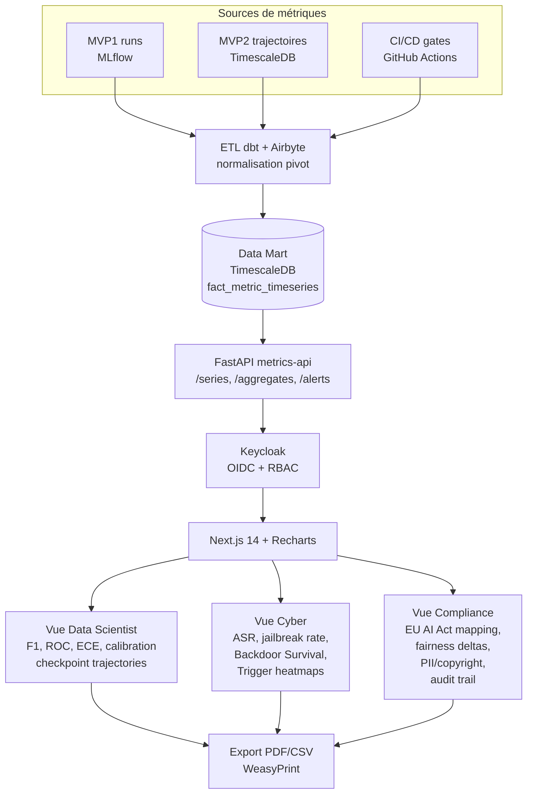
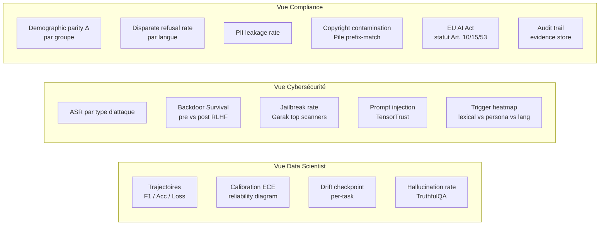
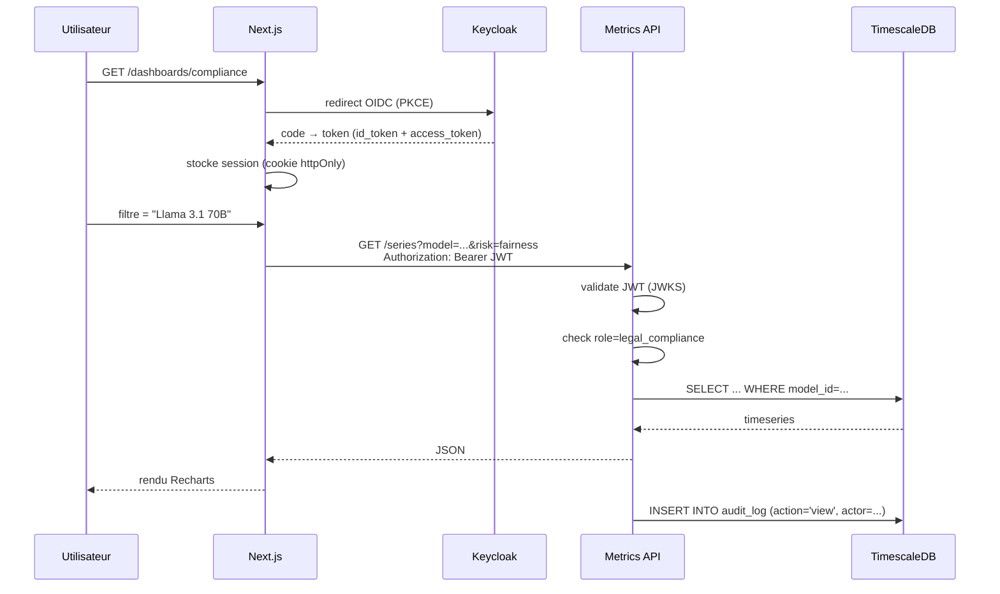
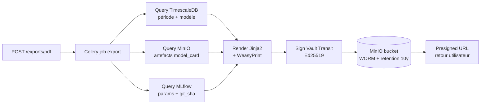

# MVP 3 — Courbes Continues & Ségrégation Métier (Dashboards RBAC)

> Voir [ROADMAP.md](./ROADMAP.md) pour la vision globale et la stack transverse.
> Pré-requis : [MVP1](./MVP1_noyau_statique.md) (sources MLflow) et [MVP2](./MVP2_laboratoire_injection.md) (trajectoires TimescaleDB).

## 1. Périmètre

- **Fin des scores binaires** "conforme / non conforme" qui créent des "falaises réglementaires" dangereuses.
- Génération de **courbes longitudinales continues** (F1, ROC, ECE, ASR, fairness deltas).
- 3 tableaux de bord **filtrés par rôle**, branchés sur Keycloak.
- **Audit trail** signé exportable PDF.
- **Hors périmètre** : interception live (→ MVP4).

## 2. Architecture



## 3. Modèle de données dashboard

```sql
-- TimescaleDB hypertable
CREATE TABLE fact_metric_timeseries (
    ts            TIMESTAMPTZ NOT NULL,
    run_id        UUID,
    model_id      TEXT,
    checkpoint    TEXT,
    lifecycle     TEXT,        -- data | pretrain | finetune | inference | production
    risk_dim      TEXT,        -- robustness | fairness | toxicity | safety | privacy
    metric        TEXT,        -- F1, ROC_AUC, ASR, ECE, demographic_parity_diff...
    value         DOUBLE PRECISION,
    group_label   TEXT,        -- pour fairness, par groupe protégé
    eu_ai_act_ref TEXT[],
    nist_rmf_ref  TEXT[]
);
SELECT create_hypertable('fact_metric_timeseries', 'ts');

-- Continuous aggregate pour les vues rapides
CREATE MATERIALIZED VIEW metric_hourly
WITH (timescaledb.continuous) AS
SELECT time_bucket('1 hour', ts) AS bucket,
       model_id, risk_dim, metric,
       avg(value) AS avg_v, max(value) AS max_v,
       percentile_cont(0.95) WITHIN GROUP (ORDER BY value) AS p95
FROM fact_metric_timeseries
GROUP BY 1, model_id, risk_dim, metric;

-- Audit trail immuable
CREATE TABLE audit_log (
    id           UUID PRIMARY KEY,
    ts           TIMESTAMPTZ DEFAULT now(),
    actor        TEXT,         -- Keycloak sub
    role         TEXT,
    action       TEXT,         -- view | export | freeze_release | escalate
    resource     TEXT,
    payload_hash TEXT,         -- SHA-256
    signature    TEXT          -- Ed25519
);
```

## 4. Vues par rôle



### 4.1 Détails Vue Data Scientist

- Sélecteur multi-modèles + multi-checkpoints (overlay).
- Composants : line charts (Recharts), heatmaps (Plotly), reliability diagrams (D3 custom).
- Drill-down : clic sur un point → JSONL des sorties brutes (MinIO presigned URL).
- Comparaison A/B : 2 modèles côte-à-côte avec deltas signés.

### 4.2 Détails Vue Cybersécurité

- Liste live des attaques en cours / récentes (statut, ASR).
- Heatmap 2D : axes = type de trigger × type de comportement cible.
- Panel "rejouer attaque" : envoie au Trigger Activator (MVP2) un trigger paramétré.
- Alertes Slack/Teams si Backdoor Survival > 0.4 sur un modèle en validation.

### 4.3 Détails Vue Compliance

- Mapping interactif EU AI Act → métriques → seuils légaux configurables.
- Bandes vertes/orange/rouges au lieu de scores binaires.
- Export PDF audit signé (preuve Art. 53).
- Action **freeze release** : marque un modèle comme bloqué (RBAC).

## 5. RBAC — matrice

| Rôle Keycloak | Vue DS | Vue Cyber | Vue Compliance | Export | Action |
|---|:-:|:-:|:-:|:-:|:-:|
| `ml_researcher` | ✓ | lecture | — | CSV | — |
| `data_scientist` | ✓ | — | — | CSV | — |
| `secops` | lecture | ✓ | lecture | CSV/PDF | rejouer attaque |
| `legal_compliance` | — | lecture | ✓ | PDF audit | freeze release |
| `risk_manager` | lecture | lecture | ✓ | PDF audit | escalade |
| `executive` | summary | summary | summary | PDF brief | — |

## 6. Stack détaillée

| Couche | Tech | Version | Rôle |
|---|---|---|---|
| ETL | dbt-core | 1.8 | Modélisation pivot |
| | Airbyte (Postgres → TS) | 0.60 | Connecteurs source |
| | Kafka Connect | 7.5 | Streaming optionnel |
| Data Mart | TimescaleDB | 2.16 | Hypertables + continuous aggregates |
| API | FastAPI + asyncpg | 0.110 / 0.29 | Endpoints metrics |
| | Pandas / DuckDB ad-hoc | 2.x / 1.1 | Analytics rapide |
| AuthN/Z | Keycloak | 24 | OIDC + JWT + scopes |
| Frontend | Next.js (App Router) | 14 | SSR + React Server Components |
| | TanStack Query | 5 | Cache client |
| | Recharts | 2.12 | Charts standards |
| | Plotly.js | 2.35 | Heatmaps, 3D |
| | D3.js | 7 | Custom (reliability diagram) |
| PDF export | WeasyPrint + Jinja2 | 62 / 3.1 | Rapports audit |
| Alerting | Grafana Alerting | 11 | Slack / Teams / email |
| Audit trail | Postgres immutable log + signature SHA-256 / Ed25519 | — | Conformité Art. 53 |
| Signing keys | HashiCorp Vault Transit engine | 1.18 | Rotation, audit |

## 7. Flux d'authentification & autorisation



## 8. Endpoints API metrics-api

```
GET  /api/v1/series?model=&risk=&metric=&from=&to=    # série temporelle
GET  /api/v1/aggregates?bucket=1h|1d&...              # via continuous aggregate
GET  /api/v1/compare?model_a=&model_b=&metric=        # delta A/B
GET  /api/v1/alerts                                   # alertes actives
POST /api/v1/exports/pdf                              # demande export audit
GET  /api/v1/exports/{id}                             # statut + URL
POST /api/v1/actions/freeze-release                   # action Compliance
GET  /api/v1/audit-log?actor=&from=&to=               # consultation trail
```

## 9. Templates d'export audit (Art. 53)



Le PDF inclut :
- En-tête : auditeur, modèle, période, hash chaîne de blocs intégrée.
- Tableaux de métriques par dimension de risque.
- Mapping EU AI Act / NIST RMF.
- Liste des incidents et actions Compliance.
- Empreinte cryptographique signée + QR code de vérification.

## 10. Critères de sortie MVP 3

- [ ] Toute métrique de MVP 1 et MVP 2 visualisable en série temporelle.
- [ ] 3 vues RBAC séparées, testées avec 6 personas (ml_researcher, data_scientist, secops, legal_compliance, risk_manager, executive).
- [ ] Export PDF audit signé (Ed25519 via Vault) pour la vue Compliance.
- [ ] **Aucun score binaire** dans l'UI : tout est continu + seuils visualisés en bandes.
- [ ] Audit trail consultable et exportable, retention 10 ans bucket WORM.
- [ ] Latence p95 page dashboard < 2 s sur 100 k points de série.
- [ ] Tests E2E Playwright sur les 3 vues + 6 personas (matrice RBAC validée).

## 11. Risques spécifiques MVP 3

| Risque | Mitigation |
|---|---|
| Volume TimescaleDB explose (1 M points / jour) | Continuous aggregates + retention policy 90j sur raw, 5y sur agrégats |
| Personas réticents à abandonner les scores binaires | Atelier UX co-design + bandes seuils visuelles claires |
| Fuite cross-rôle via API (forced browsing) | Tests RBAC automatisés sur chaque endpoint, scopes JWT vérifiés |
| Signature audit non-vérifiable hors-ligne | Publier la clé publique Vault + outil CLI de vérification standalone |
| Performance dashboards sur gros catalogue | Pagination + virtual scrolling + caching TanStack Query |
