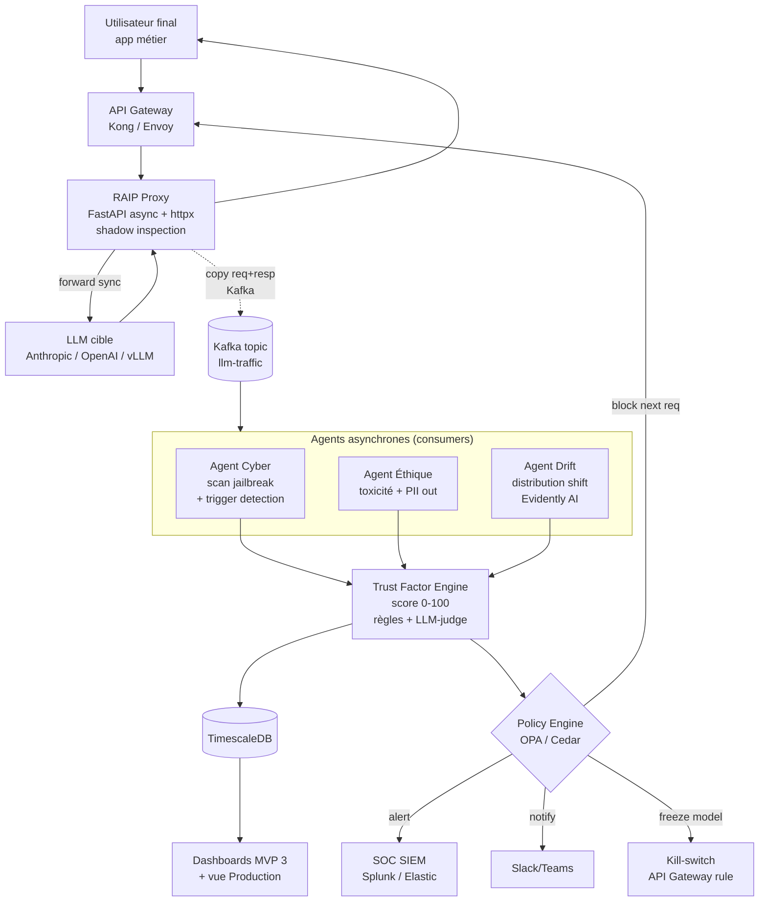
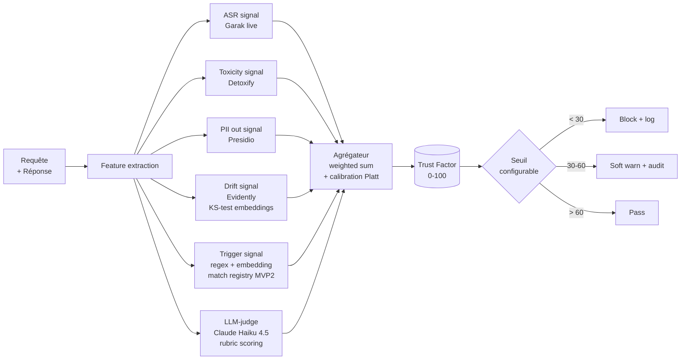
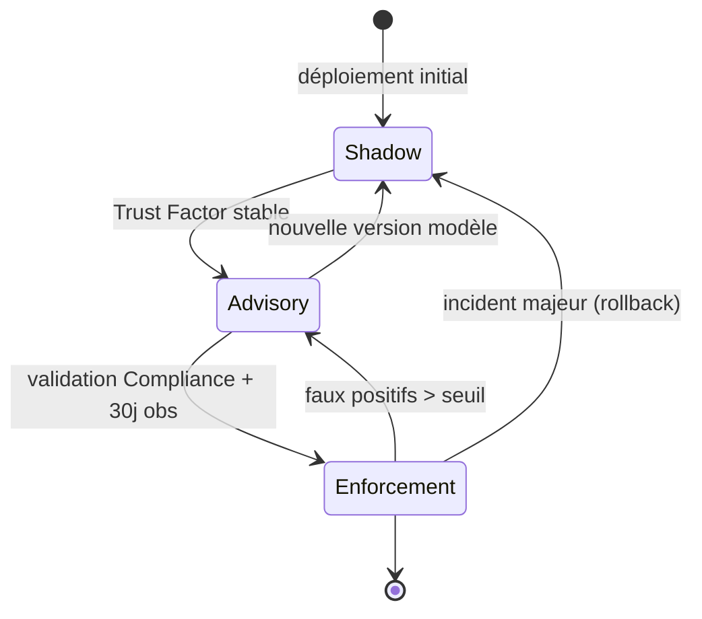
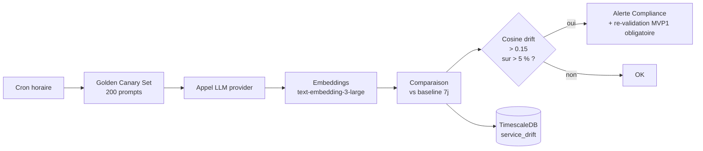

# MVP 4 — Governance-as-a-Service (GaaS) en Production

> Voir [ROADMAP.md](./ROADMAP.md) pour la vision globale et la stack transverse.
> Pré-requis : MVP1 (benchmarks), MVP2 (trigger registry), MVP3 (dashboards & audit).

## 1. Périmètre

- Surveillance du modèle **déployé en vie réelle**.
- Détection de la **dérive de service** (modification d'API propriétaire, évolution des requêtes utilisateurs).
- Calcul d'un **Facteur de Confiance** en temps réel.
- **Blocage / alerting** sur déclenchement de backdoor sans interrompre le débit global.
- Mode opérationnel progressif **Shadow → Advisory → Enforcement**.

## 2. Architecture proxy asynchrone



## 3. Trust Factor Engine



### 3.1 Pondérations par défaut

```yaml
trust_factor:
  weights:
    asr_signal:     0.25
    toxicity:       0.15
    pii_out:        0.20
    drift:          0.10
    trigger_match:  0.20
    llm_judge:      0.10
  calibration:
    method: "platt"
    fitted_on: "validation_set_v3"
  thresholds:
    block:    30
    warn:     60
    pass:     60
```

## 4. Stack détaillée

| Couche | Tech | Version | Rôle |
|---|---|---|---|
| Gateway | **Kong** ou **Envoy** + ext_authz | 3.7 / 1.31 | Routage + RBAC inbound |
| Proxy d'inspection | FastAPI + httpx + asyncio + uvloop | 0.110 / 0.27 | Shadow async, latence < 10 ms |
| Bus | **Apache Kafka** + Schema Registry (Avro) | 3.7 | Découplage trafic/eval |
| Drift detection | **Evidently AI** | 0.4 | KS, Wasserstein |
| | **NannyML** | 0.12 | Drift sans ground truth |
| | **Alibi-Detect** | 0.12 | Embedding drift |
| Trigger registry | Qdrant (embeddings triggers MVP2) + Postgres metadata | 1.11 / 16 | Détection rapide |
| LLM-judge | **Claude Haiku 4.5** (low cost) ou Llama 3.1 8B local (vLLM) | — | Rubric scoring |
| Policy engine | **OPA** (Rego) ou **Cedar** (AWS) | 0.69 / 4.x | Décisions auditables |
| Kill-switch | Kong plugin custom + feature flag (**LaunchDarkly** / Unleash) | — | Coupure granulaire |
| SIEM | Elastic Security ou Splunk | 8.15 | Corrélation incidents |
| Stream processing | Kafka Streams ou **Apache Flink** | 1.20 | Aggregations temps réel |
| Secrets | HashiCorp Vault | 1.18 | Clés API LLM, rotations |
| Embeddings live | text-embedding-3-large (OpenAI) ou bge-large self-hosted | — | Drift + trigger match |

## 5. Modes de fonctionnement



| Mode | Comportement | Décision sur Trust Factor < 30 |
|---|---|---|
| **Shadow** | observe, ne bloque rien | log uniquement |
| **Advisory** | alerte SOC + log | notification, pas de blocage |
| **Enforcement** | blocage actif | block + alerte + escalade |

## 6. Détection de "dérive de service"



- **Golden canary** : 200 prompts couvrant les 5 dimensions de risque, exécutés chaque heure.
- **Versionning** des réponses provider en MinIO bucket `canary-responses`.
- **Embeddings cache** : Redis avec TTL 7j pour comparaisons rapides.
- **Trigger** : alerte Compliance si dérive > 0.15 sur > 5 % du golden set → re-validation des benchmarks MVP1 obligatoire.

## 7. Endpoints & flux

### 7.1 Proxy

```
POST /v1/chat/completions    # compatible OpenAI/Anthropic schema
GET  /v1/health              # health proxy + provider
GET  /v1/trust/{request_id}  # consulter Trust Factor d'une requête
```

### 7.2 Admin GaaS

```
GET  /admin/v1/policies              # liste OPA policies actives
POST /admin/v1/policies              # déploie nouvelle policy
POST /admin/v1/kill-switch/{model}   # active kill-switch
GET  /admin/v1/incidents             # incidents Trust Factor < 30
POST /admin/v1/mode/{model}          # passe Shadow|Advisory|Enforcement
```

## 8. Politique OPA (exemple)

```rego
package raip.gaas

default allow = false

allow {
  input.trust_factor >= 60
}

allow {
  input.trust_factor >= 30
  input.mode == "advisory"
}

deny[reason] {
  input.trust_factor < 30
  input.mode == "enforcement"
  reason := sprintf("blocked: trust_factor=%v", [input.trust_factor])
}

deny[reason] {
  input.trigger_match.severity >= 4
  reason := "blocked: known backdoor trigger detected"
}

# Audit obligatoire sur tout block
audit[event] {
  deny[_]
  event := {
    "request_id": input.request_id,
    "model": input.model,
    "actor": input.user,
    "trust_factor": input.trust_factor,
    "policy_version": "v1.3.2"
  }
}
```

## 9. Performance & SLO

| Indicateur | Cible | Mesure |
|---|---|---|
| Latence ajoutée par proxy (p99) | < 15 ms | OTel span `proxy.forward` |
| Throughput soutenu | 1000 req/s | k6 load test |
| Détection backdoor connu | < 5 s | trigger registry hit |
| Disponibilité proxy | 99.95 % | Prometheus uptime |
| Faux positifs Trust Factor (Enforcement) | < 0.5 % | feedback loop SOC |
| Couverture canary set | 200 prompts × 5 dim | cron horaire |

## 10. Audit & conformité (Art. 53 + ISO 42001)

- Tous les événements `block`, `warn`, `freeze`, `mode_change` → bucket S3 **WORM** (Object Lock retention 10 ans).
- Journal immuable signé Ed25519 (Vault Transit) chaîne par hash (Merkle).
- Export quotidien chiffré vers SIEM Elastic + Splunk.
- Rapports mensuels auto-générés vers la vue Compliance MVP3.

## 11. Critères de sortie MVP 4

- [ ] Latence p99 ajoutée par le proxy < 15 ms.
- [ ] Throughput soutenu : 1000 req/s sans dégradation Trust Factor.
- [ ] Détection en < 5 s du déclenchement d'un backdoor connu (issu de MVP2).
- [ ] Politique OPA exportable signée + journal immuable (WORM bucket S3).
- [ ] Mode `kill-switch` testé en chaos engineering (Litmus / Chaos Mesh).
- [ ] Dérive de service détectée < 1 h sur changement provider simulé.
- [ ] Pilote Shadow → Advisory → Enforcement validé sur 90 jours d'observation.
- [ ] Audit immuable vérifié par tiers externe (CLI de vérification publique).

## 12. Risques spécifiques MVP 4

| Risque | Mitigation |
|---|---|
| Faux positifs Trust Factor → blocage abusif | Mode shadow long, calibration Platt, override humain Compliance |
| Détection de backdoor échouée (zero-day trigger) | Defense-in-depth : LLM-judge + drift + canary set + agents indépendants |
| Régressions silencieuses sur upgrades providers | Golden canary set 200 prompts × heure, alertes drift > 0.15 |
| Latence proxy dégradée sous charge | Bénchmark continu, autoscaling HPA, cache Redis sur fingerprints |
| Coût LLM-judge en production | Sampling 10 % par défaut, escalade 100 % si Trust Factor litigieux |
| Empoisonnement du canary set | Hash signé + revue manuelle Compliance avant rotation |
| Bypass via streaming SSE | Inspection chunk-by-chunk + buffering jusqu'à fin de stream pour scoring |

## 13. Chaos engineering & tests

| Scénario | Outil | Critère |
|---|---|---|
| Provider Anthropic down | Litmus / Chaos Mesh | failover vers OpenAI < 10 s |
| Kafka cluster perd 1 broker | Chaos Mesh | aucun message perdu |
| Trust Factor Engine OOM | k6 load + chaos | dégrade en mode Advisory automatique |
| Trigger registry corruption | injection synthétique | détection + alerte SOC |
| Kill-switch race condition | property-based test | aucune requête ne passe après activation |
