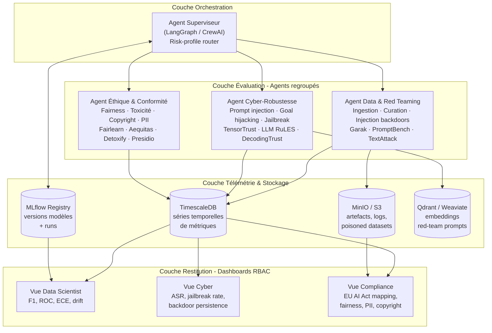
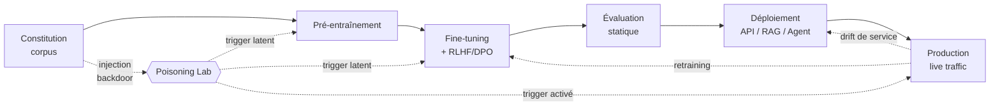
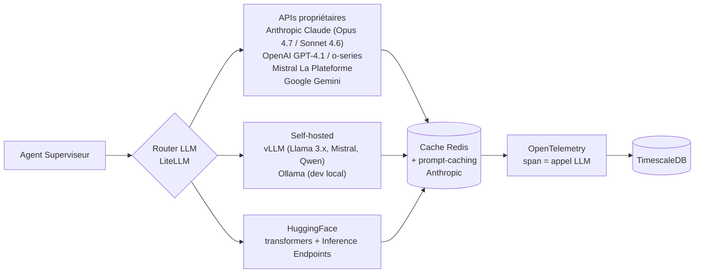
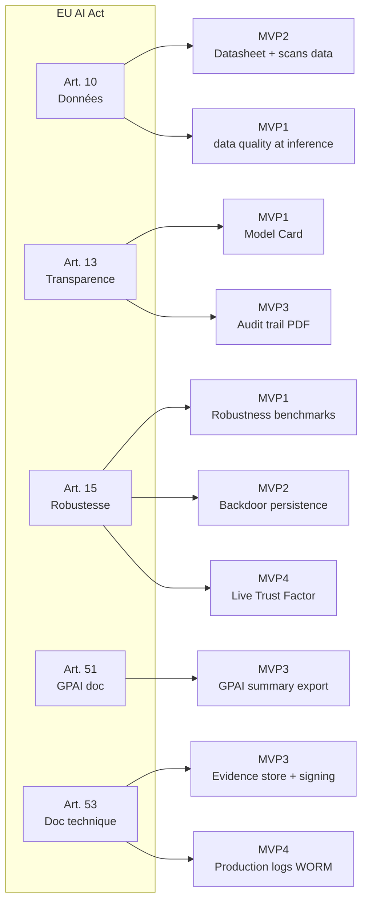
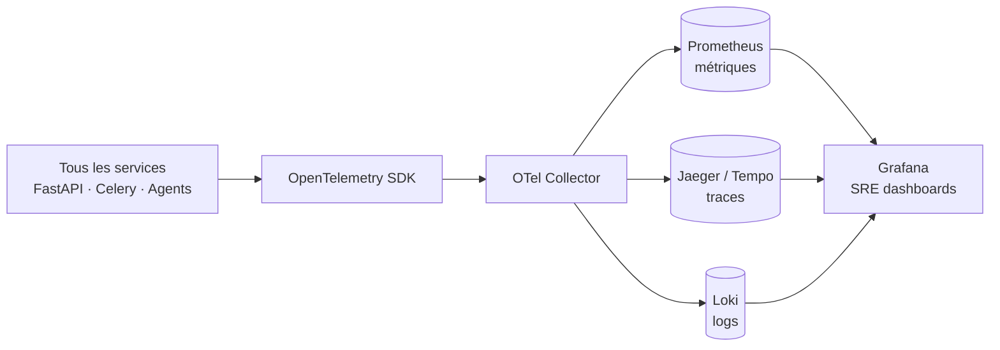
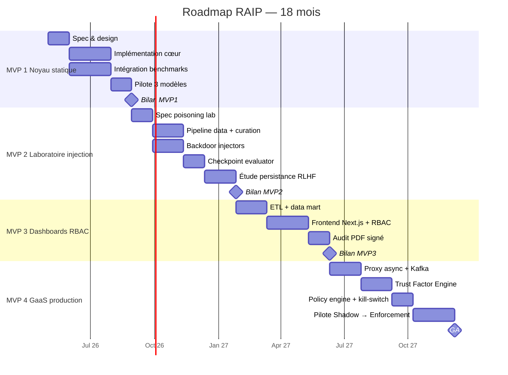

# Roadmap RAIP — Plateforme d'Évaluation Longitudinale d'IA Responsable

> Sources : `2410.07959v2.pdf` (COMPL-AI), `Évaluation Modulaire IA Cycle Vie EU AI Act.md`, `framework_open_source_ia_responsable.md`.
> Paradigme : abandon de l'évaluation statique au profit d'une **supervision longitudinale sur tout le cycle de vie**, opérée par un **système multi-agents (MAS)** branché sur une **télémétrie continue**.

## Index des MVPs

| MVP | Titre | Périmètre clé | Détail |
|---|---|---|---|
| 1 | Noyau Statique Regroupé | Inférence boîte noire, 5 dimensions de risque | [MVP1_noyau_statique.md](./MVP1_noyau_statique.md) |
| 2 | Laboratoire d'Injection | Cycle de vie data + pré-train + fine-tune, backdoors | [MVP2_laboratoire_injection.md](./MVP2_laboratoire_injection.md) |
| 3 | Dashboards RBAC | Courbes longitudinales, vues métier ségréguées | [MVP3_dashboards_rbac.md](./MVP3_dashboards_rbac.md) |
| 4 | Governance-as-a-Service | Proxy production, Trust Factor live, kill-switch | [MVP4_governance_as_a_service.md](./MVP4_governance_as_a_service.md) |

---

## 1. Architecture Cible (état de l'art)

### 1.1 Vue macro — 3 couches



### 1.2 Cycle de vie surveillé



---

## 2. Stack Technique Transverse

### 2.1 Choix structurants

| Domaine | Outil retenu | Alternative | Justification |
|---|---|---|---|
| Langage cœur | Python 3.11+ | — | Écosystème ML/LLM |
| Orchestration agents | **LangGraph** (StateGraph) | CrewAI, AutoGen | Graphe d'états, checkpoints, reprise |
| Framework LLM | **LangChain 0.3+** | LlamaIndex | Connecteurs API, abstractions tools |
| API backend | **FastAPI** + Pydantic v2 | Flask | Async, typing, OpenAPI |
| Workflow asynchrone | **Celery + Redis** | Prefect, Dagster | Long-running evals, GPU jobs |
| Tracking ML | **MLflow 2.x** | W&B, Neptune | Open-source, registry modèles |
| Séries temporelles | **TimescaleDB** | InfluxDB | SQL + extensions PG, jointures |
| Object store | **MinIO** (S3 API) | AWS S3 | Datasets empoisonnés volumineux |
| Vector DB | **Qdrant** | Weaviate, pgvector | Banque de prompts adversariaux |
| Observabilité | **Grafana + Prometheus + OpenTelemetry** | Datadog | Dashboards longitudinaux |
| Frontend dashboards | **Next.js 14 + Recharts/Plotly** | Streamlit | RBAC + courbes interactives |
| Auth/RBAC | **Keycloak** (OIDC) | Auth0 | SSO entreprise, rôles |
| Conteneurisation | **Docker + Kubernetes (Helm)** | Nomad | Scaling GPU, isolation |
| CI/CD | **GitHub Actions + ArgoCD** | GitLab CI | Gates de conformité auto |
| GPU runtime | **vLLM** + **SGLang** | TGI, Triton | Inférence batch rapide |

### 2.2 Modèles LLM — connecteurs



- **LiteLLM** comme proxy unifié → un seul SDK, swap de modèles à coût constant.
- **Prompt caching** (Anthropic) sur le system prompt long des agents red-team → divise les coûts ×10 en répétition.
- **Tokens & coût** loggés par run via callback OpenTelemetry → audit financier intégré.

### 2.3 Schéma de données canonique

```yaml
# benchmark_run.yaml — format pivot
run_id: uuid4
model:
  name: "claude-sonnet-4-6"
  version: "20251001"
  provider: "anthropic"
  checkpoint: null            # rempli si pré/fine-tuning
lifecycle_stage: "inference"  # data | pretrain | finetune | inference | production
risk_dimensions:
  - robustness
  - fairness
  - toxicity
  - safety
  - privacy
benchmarks:
  - id: "advbench_v1"
  - id: "bbq"
  - id: "real_toxicity_prompts"
metrics:
  - name: "attack_success_rate"
    value: 0.12
    unit: "ratio"
    timestamp: "2026-04-29T10:00:00Z"
  - name: "demographic_parity_diff"
    value: 0.04
    group_a: "gender_male"
    group_b: "gender_female"
artifacts:
  - s3://raip/runs/{run_id}/raw_outputs.jsonl
  - s3://raip/runs/{run_id}/model_card.md
governance:
  eu_ai_act_articles: ["Art.15", "Art.10", "Art.53"]
  nist_rmf: ["MEASURE-2.7", "MANAGE-1.3"]
```

---

## 3. Mapping EU AI Act × MVPs



| Norme / Standard | Couverture |
|---|---|
| **NIST AI RMF 1.0** (Govern → Map → Measure → Manage) | MVP1 (Measure), MVP2 (Map des risques training), MVP3 (Govern dashboards), MVP4 (Manage live) |
| **ISO/IEC 42001:2023** | Audit trail MVP3, kill-switch MVP4 |
| **Model Cards** (Mitchell et al.) | Generator MVP1, mis à jour MVP2/3 |
| **Datasheets for Datasets** (Gebru et al.) | MVP2 |
| **GPAI Code of Practice** | Export MVP3 |

---

## 4. Sécurité, observabilité, FinOps transverses

### 4.1 Sécurité plateforme

- **Vault** pour les credentials LLM (rotation J-30).
- **Network policies** Kubernetes : agents en namespace isolés, egress allowlist (api.anthropic.com, api.openai.com…).
- **Pod Security Standards** restricted, **gVisor** sandbox pour exécution de payloads adversariaux.
- **Signed container images** (Cosign) + admission control (Kyverno).
- **Secrets scanning** sur tous les datasets entrants (TruffleHog, gitleaks).

### 4.2 Observabilité



- Span dédié `llm.call` avec attributs `model`, `tokens_in`, `tokens_out`, `cost_usd`, `latency_ms`.
- SLO publiés : disponibilité API 99.5 %, latence eval p95, erreur LLM < 1 %.

### 4.3 FinOps LLM

- LiteLLM logge le coût par run → table `fact_llm_cost`.
- Budgets par projet, alertes Prometheus à 80 % / 100 %.
- Prompt caching agressif (Anthropic) sur system prompts > 1024 tokens.
- Batch API (Anthropic, OpenAI) pour évaluations massives non temps-réel : -50 % de coût.

---

## 5. Planning & jalons



---

## 6. Risques & mitigations

| Risque | Impact | Mitigation |
|---|---|---|
| Coût LLM explose sur red-teaming itératif | Élevé | Prompt caching, batch API, modèles open-source self-hosted vLLM, budget caps |
| Faux positifs Trust Factor → blocage abusif | Élevé | Mode shadow long, calibration Platt, override humain Compliance |
| Détection de backdoor échouée (zero-day trigger) | Critique | Defense-in-depth : LLM-judge + drift + canary set |
| Régressions silencieuses sur upgrades providers | Moyen | Golden canary set 200 prompts × heure, alertes drift > 0.15 |
| Charge légale (RGPD) sur datasets poisoned | Élevé | Datasheets obligatoires, isolation MinIO, DPIA dédiée Poisoning Lab |
| Résistance organisationnelle (3 dashboards séparés) | Moyen | Co-design ateliers personas, formation rôles, exec summary unifié |

---

## 7. Décisions ouvertes

1. **Self-hosted vs API** pour l'**Agent Cyber-Robustesse** : faut-il imposer Llama 3.1 70B local pour ne pas exposer de prompts adversariaux à des providers externes ?
2. **Stockage triggers** : Postgres seul, ou Qdrant + Postgres ? Tradeoff vitesse/transactionnalité.
3. **LLM-judge** dans le Trust Factor : Claude Haiku 4.5 (qualité) vs Llama 3.1 8B local (souveraineté + coût).
4. **Frontend** : Next.js custom vs Grafana avec plugins (gain de temps mais RBAC fin plus dur).
5. **Politique de blocage MVP4** : OPA (Rego, plus mature) vs Cedar (typage plus fort, plus jeune).
6. **Quel niveau d'open-source** : on publie le Poisoning Lab ? (risque de prolifération vs valeur recherche).
