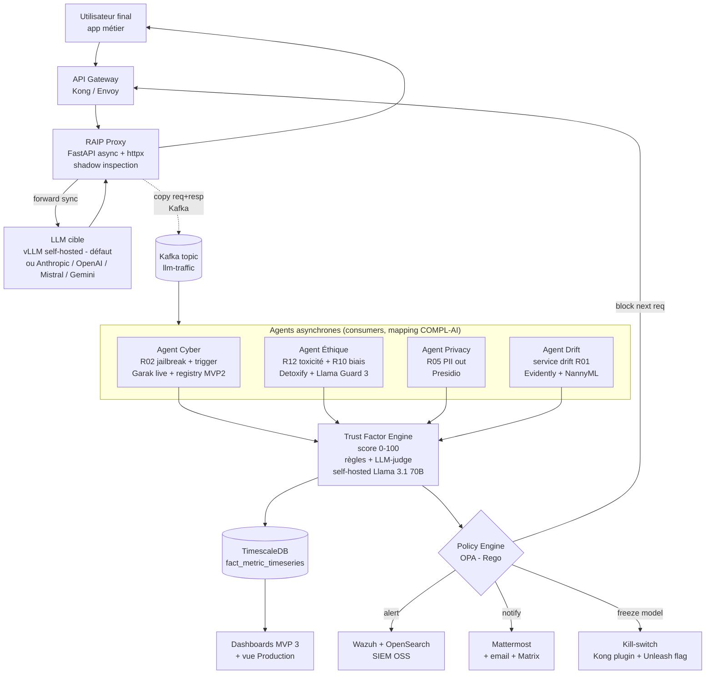
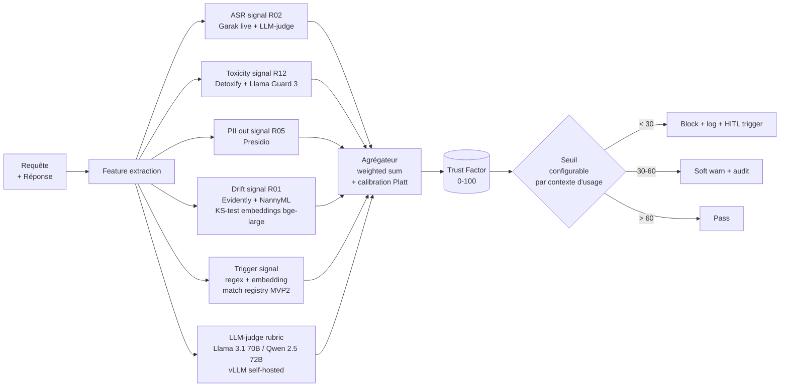
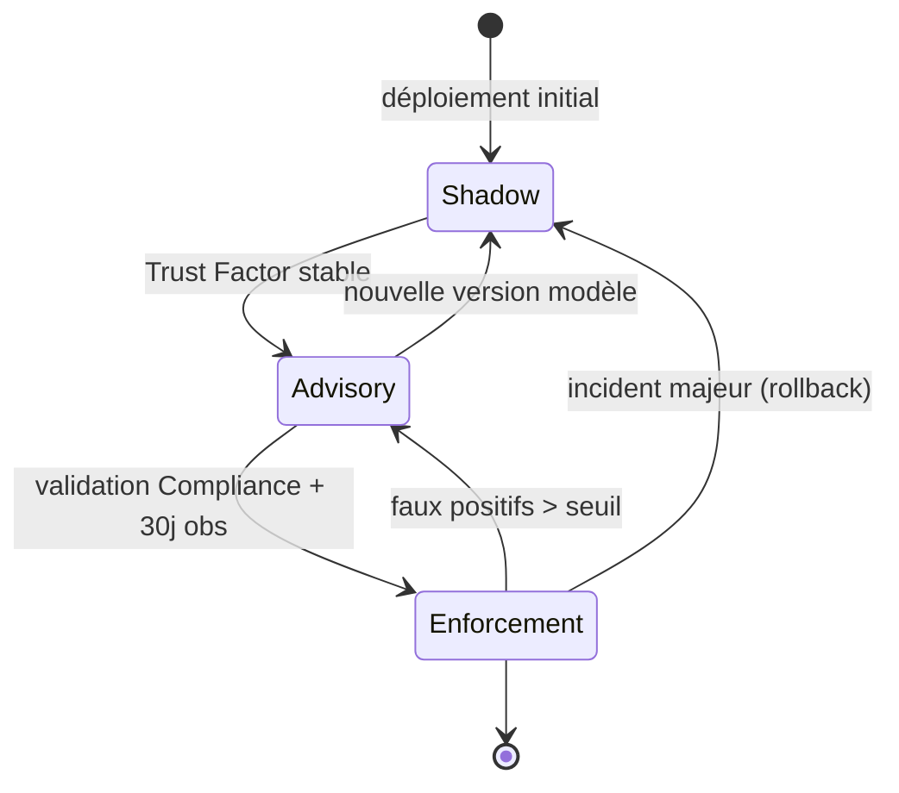
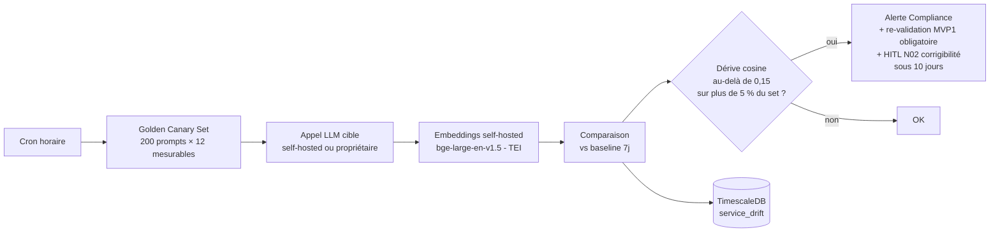

---
doc:
  title: "MVP 4 — Governance-as-a-Service (production)"
  slug: mvp4-gaas
  language: fr
  summary: |
    Proxy production, Trust Factor temps réel, kill-switch ; s'appuie sur MVP1–MVP3.
  type: mvp
  audience: [human, developer, compliance, ai-agent]
  navigation:
    hub: ./ROADMAP.md
    requires:
      - ./MVP1_noyau_statique.md
      - ./MVP2_laboratoire_injection.md
      - ./MVP3_dashboards_rbac.md
  related_paths:
    - ./ROADMAP.md
  tags: [mvp4, production, opa, unleash, trust-factor]
last_reviewed: "2026-05-12"
---

# MVP 4 — Governance-as-a-Service (GaaS) en Production

> Voir [ROADMAP.md](./ROADMAP.md) pour la vision globale, la stack OSS et le référentiel **18 exigences COMPL-AI** (§3).
> Pré-requis : MVP1 (benchmarks R01..R12 mesurables), MVP2 (trigger registry, R02 étendu), MVP3 (dashboards, HITL, audit signé).
>
> **État d'implémentation** : ce document décrit la **cible complète**. Une **tranche fine** est livrée
> sur l'infra existante (Redis/Celery) — **Trust Factor** (§3), **détection de dérive à la demande** et
> **kill-switch** (§5) — surfacés dans le dashboard. Le proxy inline, Kafka, OPA, Kong et le SIEM
> restent **reportés**. Détails : [MVP3_MVP4_IMPLEMENTATION.md](./MVP3_MVP4_IMPLEMENTATION.md).

## 1. Périmètre

- Surveillance du modèle **déployé en vie réelle**.
- Détection de la **dérive de service** (modification d'API propriétaire, évolution des requêtes utilisateurs).
- Calcul d'un **Facteur de Confiance** en temps réel.
- **Blocage / alerting** sur déclenchement de backdoor sans interrompre le débit global.
- Mode opérationnel progressif **Shadow → Advisory → Enforcement**.
- **Obligation héritée (ROADMAP)** : le proxy et le Trust Factor ne doivent **jamais** consommer de scores, seuils ou canarys dérivés du pilote MVP1 — voir §1.1.

### 1.1 Suppression complète des mock MVP1 en production (obligation MVP4)

| Réf. ROADMAP | Action obligatoire |
|---|---|
| **M11** | Trust Factor, canary set (200×5), LLM-judge live et embeddings : **uniquement** métriques issues du catalogue signé MVP2+ ; **aucun** import `raip.benchmarks.pilote_v1` dans le service proxy. |
| **M8** (extension) | Chaos / load tests : vérification qu’aucune route du proxy ne référence des réponses « stub » ou corpus synthétique. |
| **M10** (extension) | Vue Production MVP3 alimentée exclusivement par télémétrie live **non pilote** ; corrélation avec trigger registry MVP2 réelle. |

**Critère de vérification** : audit egress + revue statique du binaire/image proxy : **zéro** dépendance à `pilote_v1` ; test d’acceptation Enforcement sur backdoor **réel** (MVP2), pas sur prompt du JSONL pilote.

## 2. Architecture proxy asynchrone



## 3. Trust Factor Engine



### 3.1 Pondérations par défaut

```yaml
trust_factor:
  weights:
    asr_signal:     0.25
    toxicity:       0.15
    pii_out:        0.20
    drift:          0.10
    trigger_match:  0.20
    llm_judge:      0.10
  calibration:
    method: "platt"
    fitted_on: "validation_set_v3"
  thresholds:
    block:    30
    warn:     60
    pass:     60
```

## 4. Stack détaillée

| Couche | Tech (OSS) | Licence | Rôle |
|---|---|---|---|
| Gateway | **Kong Gateway** OSS ou **Envoy** + ext_authz | Apache 2 / Apache 2 | Routage + RBAC inbound |
| Proxy d'inspection | FastAPI + httpx + asyncio + uvloop | MIT | Shadow async, latence < 10 ms |
| Bus | **Apache Kafka** + Schema Registry **Karapace** (alt: Redpanda Community, NATS JetStream) | Apache 2 | Découplage trafic/eval |
| Drift detection | **Evidently AI** | Apache 2 | KS, Wasserstein |
| | **NannyML** | Apache 2 | Drift sans ground truth |
| | **Alibi-Detect** | Apache 2 | Embedding drift |
| Trigger registry | Qdrant (embeddings MVP2) + Postgres metadata | Apache 2 / PostgreSQL License | Détection rapide |
| LLM-judge | **Llama 3.1 70B** ou **Qwen 2.5 72B** sur **vLLM self-hosted** | Llama Community / Apache 2 | Rubric scoring **souverain** — JAMAIS d'API propriétaire |
| Policy engine | **Open Policy Agent** (Rego) | Apache 2 | Décisions auditables |
| Kill-switch | Kong plugin custom + feature flag **Unleash** (alt: GrowthBook, OpenFeature + flagd) | Apache 2 | Coupure granulaire |
| SIEM | **Wazuh** + **OpenSearch** (alt: SecurityOnion, Graylog OSS) | GPL v2 / Apache 2 | Corrélation incidents |
| Stream processing | **Apache Flink** ou Kafka Streams | Apache 2 | Aggregations temps réel |
| Secrets | **OpenBao** (fork OSS de Vault) | MPL 2 | Clés API LLM, rotations, signing |
| Embeddings live | **bge-large-en-v1.5** / **bge-m3** / **e5-mistral-7b** sur **Text Embeddings Inference** (TEI) ou **vLLM** — self-hosted | MIT (modèles) / Apache 2 (TEI) | Drift + trigger match — JAMAIS OpenAI embeddings |
| Notifications | Mattermost Team Edition (alt: Matrix Synapse + Element, Rocket.Chat) | MIT / Apache 2 | Canal Compliance/SOC |
| Chaos engineering | Chaos Mesh + LitmusChaos | Apache 2 | Tests résilience |

## 5. Modes de fonctionnement



| Mode | Comportement | Décision sur Trust Factor < 30 |
|---|---|---|
| **Shadow** | observe, ne bloque rien | log uniquement |
| **Advisory** | alerte SOC + log | notification, pas de blocage |
| **Enforcement** | blocage actif | block + alerte + escalade |

## 6. Détection de "dérive de service"



- **Golden canary** : 200 prompts couvrant les **12 exigences mesurables** R01..R12, exécutés chaque heure.
- **Versionnage** des réponses cible en MinIO bucket `canary-responses` (Object Lock + retention 1 an).
- **Embeddings cache** : Redis avec TTL 7j pour comparaisons rapides — modèles **self-hosted uniquement** (bge-large via TEI).
- **Trigger** : alerte Compliance si dérive > 0.15 sur > 5 % du golden set → re-validation des benchmarks MVP1 obligatoire + **panel HITL N02** (corrigibilité) déclenché sous 10 jours ouvrés.

## 7. Endpoints & flux

### 7.1 Proxy

```
POST /v1/chat/completions    # compatible OpenAI/Anthropic schema
GET  /v1/health              # health proxy + provider
GET  /v1/trust/{request_id}  # consulter Trust Factor d'une requête
```

### 7.2 Admin GaaS

```
GET  /admin/v1/policies              # liste OPA policies actives
POST /admin/v1/policies              # déploie nouvelle policy
POST /admin/v1/kill-switch/{model}   # active kill-switch
GET  /admin/v1/incidents             # incidents Trust Factor < 30
POST /admin/v1/mode/{model}          # passe Shadow|Advisory|Enforcement
```

## 8. Politique OPA (exemple)

```rego
package raip.gaas

default allow = false

allow {
  input.trust_factor >= 60
}

allow {
  input.trust_factor >= 30
  input.mode == "advisory"
}

deny[reason] {
  input.trust_factor < 30
  input.mode == "enforcement"
  reason := sprintf("blocked: trust_factor=%v", [input.trust_factor])
}

deny[reason] {
  input.trigger_match.severity >= 4
  reason := "blocked: known backdoor trigger detected"
}

# Audit obligatoire sur tout block
audit[event] {
  deny[_]
  event := {
    "request_id": input.request_id,
    "model": input.model,
    "actor": input.user,
    "trust_factor": input.trust_factor,
    "policy_version": "v1.3.2"
  }
}
```

## 9. Performance & SLO

| Indicateur | Cible | Mesure |
|---|---|---|
| Latence ajoutée par proxy (p99) | < 15 ms | OTel span `proxy.forward` |
| Throughput soutenu | 1000 req/s | k6 load test |
| Détection backdoor connu | < 5 s | trigger registry hit |
| Disponibilité proxy | 99.95 % | Prometheus uptime |
| Faux positifs Trust Factor (Enforcement) | < 0.5 % | feedback loop SOC |
| Couverture canary set | 200 prompts × 5 dim | cron horaire |

## 10. Audit & conformité (Art. 11, 14, 15, 53 + ISO 42001)

- Tous les événements `block`, `warn`, `freeze`, `mode_change`, `hitl_trigger`, `kill_switch` → bucket **MinIO Object Lock** (Compliance/Governance mode, retention 10 ans).
- Journal immuable signé Ed25519 (**OpenBao Transit**) chaîne par hash (Merkle), horodatage RFC 3161.
- Export quotidien chiffré vers SIEM **Wazuh + OpenSearch** (self-hosted).
- Rapports mensuels auto-générés vers la vue Compliance MVP3 (couverture **18 exigences** : R01..R12 mesures live + N01..N06 statut HITL/déclaratif).
- **Couverture Art. 14 (Supervision humaine)** : tout `block` Trust Factor < 30 déclenche une notification Compliance avec option d'override humain (HITL N02 corrigibilité testée).

## 11. Critères de sortie MVP 4

- [ ] **Suppression complète des données mockées MVP1 en production** (registre ROADMAP M11 + extensions M8/M10) : Trust Factor et canary **sans** pilote/heuristiques ; image proxy et CI sans module `pilote_v1`.
- [ ] Latence p99 ajoutée par le proxy < 15 ms.
- [ ] Throughput soutenu : 1000 req/s sans dégradation Trust Factor.
- [ ] Détection en < 5 s du déclenchement d'un backdoor connu (issu de MVP2 trigger registry).
- [ ] Politique OPA exportable signée + journal immuable (**MinIO Object Lock**, 10 ans).
- [ ] Mode `kill-switch` testé en chaos engineering (LitmusChaos / Chaos Mesh).
- [ ] Dérive de service détectée < 1 h sur changement provider simulé, déclenche un panel HITL N02 sous 10 jours.
- [ ] Pilote Shadow → Advisory → Enforcement validé sur 90 jours d'observation.
- [ ] Audit immuable vérifié par tiers externe (CLI Cosign + chaîne Merkle).
- [ ] **LLM-judge production exclusivement self-hosted** (Llama 3.1 70B / Qwen 2.5 72B sur vLLM) — vérifié par audit egress.
- [ ] **Embeddings live exclusivement self-hosted** (bge-large via TEI) — vérifié par audit egress.
- [ ] **Aucune dépendance Slack/Teams obligatoire** : alertes par défaut Mattermost + email + Matrix.
- [ ] **Aucune dépendance Vault BSL** : OpenBao en production avec rotation testée.
- [ ] Vue Production sur Dashboard MVP3 : trajectoires live R01..R12 + statut HITL N01/N02 + formulaires N03..N06.

## 12. Risques spécifiques MVP 4

| Risque | Mitigation |
|---|---|
| Faux positifs Trust Factor → blocage abusif | Mode shadow long, calibration Platt, override humain Compliance |
| Détection de backdoor échouée (zero-day trigger) | Defense-in-depth : LLM-judge + drift + canary set + agents indépendants |
| Régressions silencieuses sur upgrades providers | Golden canary set 200 prompts × heure, alertes drift > 0.15 |
| Latence proxy dégradée sous charge | Benchmark continu, scaling horizontal Swarm (`docker service scale raip-proxy=N` piloté par alertes Prometheus + script de réconciliation), cache Redis sur fingerprints |
| Coût LLM-judge en production | Sampling 10 % par défaut, escalade 100 % si Trust Factor litigieux |
| Empoisonnement du canary set | Hash signé + revue manuelle Compliance avant rotation |
| Bypass via streaming SSE | Inspection chunk-by-chunk + buffering jusqu'à fin de stream pour scoring |

## 13. Chaos engineering & tests

| Scénario | Outil | Critère |
|---|---|---|
| Provider Anthropic down | Litmus / Chaos Mesh | failover vers OpenAI < 10 s |
| Kafka cluster perd 1 broker | Chaos Mesh | aucun message perdu |
| Trust Factor Engine OOM | k6 load + chaos | dégrade en mode Advisory automatique |
| Trigger registry corruption | injection synthétique | détection + alerte SOC |
| Kill-switch race condition | property-based test | aucune requête ne passe après activation |
